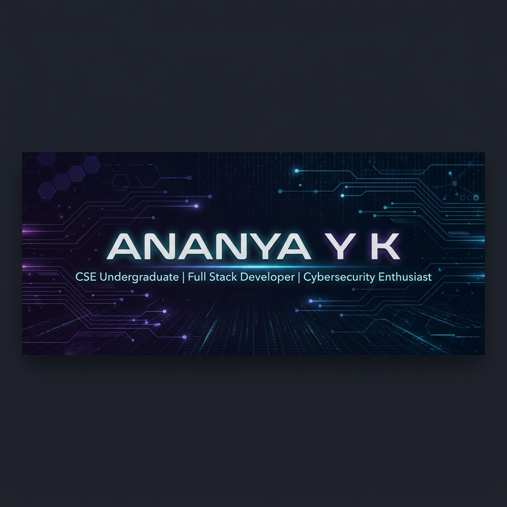

# Hi there, I'm Ananya Y K 👋

  

  
   <!-- 💡 REPLACE 'YOUR-LINKEDIN-USERNAME' WITH YOUR ACTUAL LINKEDIN USERNAME -->
  

---

### 🎓 About Me

I am a passionate **Computer Science and Engineering Undergraduate** at **Vidya Vardhaka College of Engineering**, dedicated to solving real-world problems. With a strong interest in building secure, end-to-end applications, I split my focus between **Full Stack Web Development** and **Cybersecurity**. 

- 💻 **Role:** CSE Undergraduate, Full Stack Developer, and Cybersecurity Enthusiast
- 🏫 **Institute:** Vidya Vardhaka College of Engineering (VVCE)
- 🟢 **Status:** Online & continuously learning!
- ⚡ **Fun Fact:** I love building hackathon-winning solutions in fast-paced team environments.

---

### 🛠️ Tech Stack & Skills

<table>
  <tr>
    <td valign="top" width="33%">
      <h4>💻 Languages</h4>
       
       
       
      
    </td>
    <td valign="top" width="33%">
      <h4>🌐 Web Technologies</h4>
       
       
       
      
    </td>
    <td valign="top" width="33%">
      <h4>🔧 Tools & Platforms</h4>
       
       
      
    </td>
  </tr>
</table>

---

### 🏆 Hackathons & Achievements

A timeline of key hackathon placements, competitions, and participant milestones:

* 🥇 **1st Place** | **Quick Think Challenge** – NIT Warangal
  * *2-hour design thinking & solution building challenge.*
  * 👥 **Team Name:** `nexus 1`
* 🏅 **4th Place** | **Hack the Hackers** – GSSS Institute of Engineering & Technology
  * *24-hour cybersecurity hackathon for women.*
  * 👥 **Team Name:** `team triad`
* 🎖️ **Top 10** | **Hackspirit 6.0** – PES Mandya
  * *24-hour development hackathon.*
  * 👥 **Team Name:** `Tech Nexus`
* 🚀 **Participant** | **CelestiAI Hackathon** – Dayananda Sagar University
  * 👥 **Team Name:** `byteme`
* 🚀 **Participant** | **Xypher Hackathon** – MIT Mysore

---

### 📊 GitHub Analytics

  
  

  

---

### 🐍 My Contribution Snake

  <picture>
    <source media="(prefers-color-scheme: dark)" srcset="https://raw.githubusercontent.com/ananyaayk288-lang/ananyaayk288-lang/output/github-contribution-grid-snake-dark.svg">
    <source media="(prefers-color-scheme: light)" srcset="https://raw.githubusercontent.com/ananyaayk288-lang/ananyaayk288-lang/output/github-contribution-grid-snake.svg">
    
  </picture>

