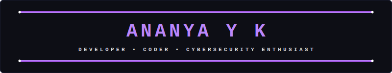
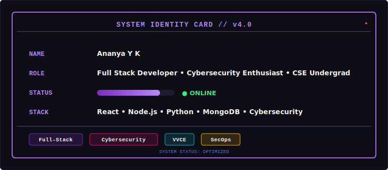
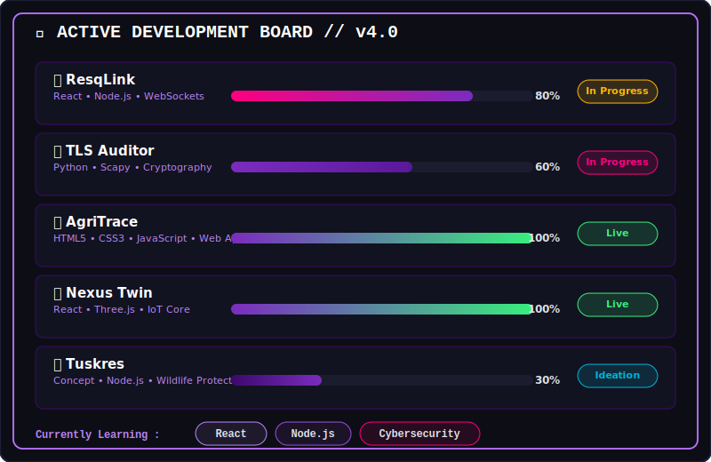

<p align="center">
  
</p>

```shell
> System.active
⚡ Full-Stack | Cybersecurity | Web-Design
```

<p align="center">
  <a href="http://www.linkedin.com/in/ananya-y-k"></a>
  <a href="mailto:ananyaayk288@gmail.com"></a>
  <a href="https://github.com/ananyaayk288-lang"></a>
  <a href="https://www.hackerrank.com/profile/ananyaayk288"></a>
</p>

---

## 👤 About Me

<p align="center">
  
</p>

---

## 🚧 What I'm Building

<p align="center">
  
</p>

---

## 🛠️ Tech Stack & Skills

<details open>
  <summary><b>🧬 Languages</b></summary>
  <br />
  <p align="left">
    <a href="https://www.python.org/"></a>
    <a href="https://developer.mozilla.org/en-US/docs/Web/JavaScript"></a>
    <a href="https://en.wikipedia.org/wiki/C%2B%2B"></a>
    <a href="https://en.wikipedia.org/wiki/C_(programming_language)"></a>
  </p>
</details>

<details open>
  <summary><b>🖥️ Frontend &amp; UI</b></summary>
  <br />
  <p align="left">
    <a href="https://react.dev/"></a>
    <a href="https://html.spec.whatwg.org/"></a>
  </p>
</details>

<details open>
  <summary><b>⚙️ Backend &amp; APIs</b></summary>
  <br />
  <p align="left">
    <a href="https://nodejs.org/"></a>
  </p>
</details>

<details open>
  <summary><b>🗄️ Databases</b></summary>
  <br />
  <p align="left">
    <a href="https://www.mongodb.com/"></a>
    <a href="https://supabase.com/"></a>
  </p>
</details>

<details open>
  <summary><b>🎨 Design • Creative</b></summary>
  <br />
  <p align="left">
    <a href="https://www.figma.com/"></a>
    <a href="https://www.canva.com/"></a>
    <a href="https://notebooklm.google/"></a>
  </p>
</details>

---

## 🏆 Hackathons &amp; Achievements

A timeline of key hackathon placements, competitions, and participant milestones:

* 🥇 **1st Place** | **Quick Think Challenge** – NIT Warangal
  * *2-hour design thinking &amp; solution building challenge.*
  * 👥 **Team Name:** `nexus 1`
* 🏅 **4th Place** | **Hack the Hackers** – GSSS Institute of Engineering &amp; Technology
  * *24-hour cybersecurity hackathon for women.*
  * 👥 **Team Name:** `team triad`
* 🎖️ **Top 10** | **Hackspirit 6.0** – PES Mandya
  * *24-hour development hackathon.*
  * 👥 **Team Name:** `Tech Nexus`
* 🚀 **Participant** | **CelestiAI Hackathon** – Dayananda Sagar University
  * 👥 **Team Name:** `byteme`
* 🚀 **Participant** | **Xypher Hackathon** – MIT Mysore

---

## 📊 GitHub Analytics

<p align="center">
  
  
</p>

<p align="center">
  
</p>

---

## 🐍 My Contribution Snake

<p align="center">
  <picture>
    <source media="(prefers-color-scheme: dark)" srcset="https://raw.githubusercontent.com/ananyaayk288-lang/ananyaayk288-lang/output/github-contribution-grid-snake-dark.svg">
    <source media="(prefers-color-scheme: light)" srcset="https://raw.githubusercontent.com/ananyaayk288-lang/ananyaayk288-lang/output/github-contribution-grid-snake.svg">
    
  </picture>
</p>
